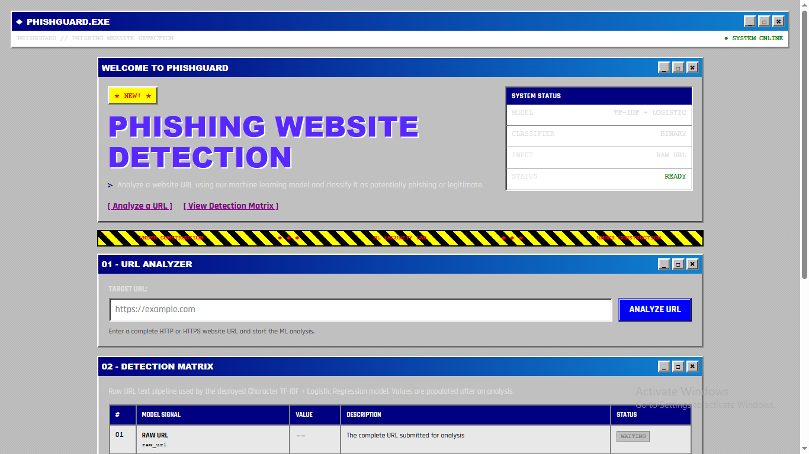
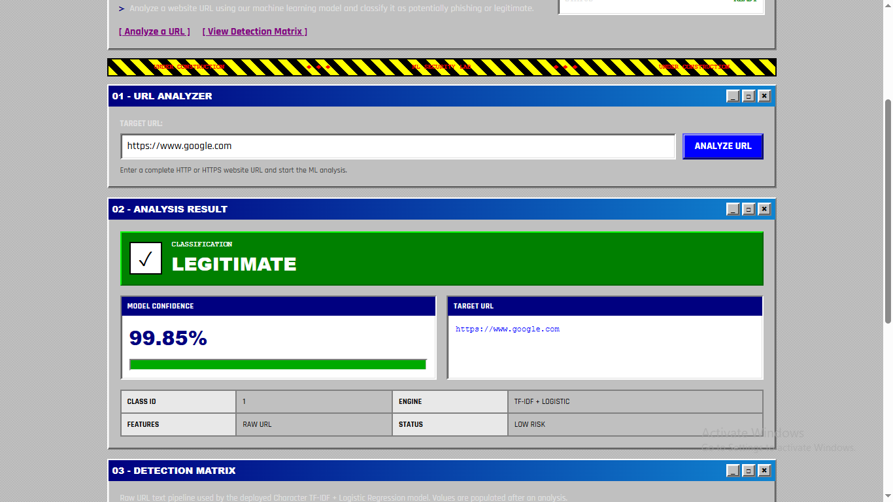
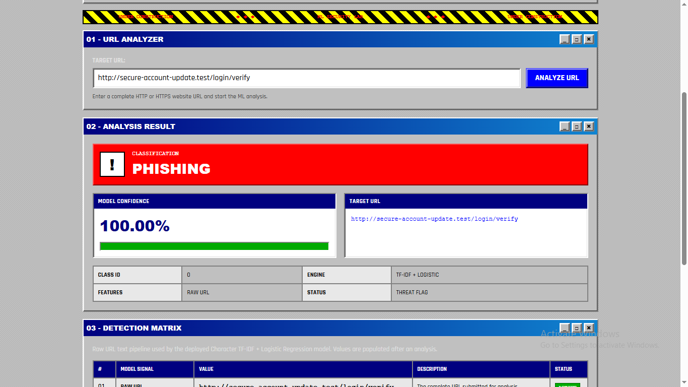
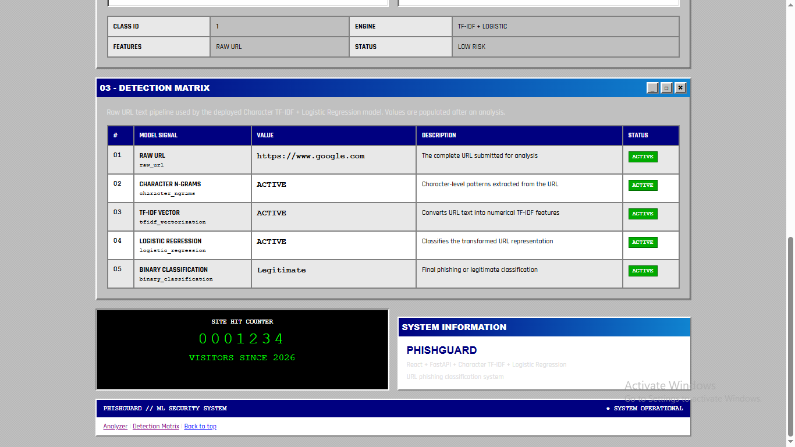
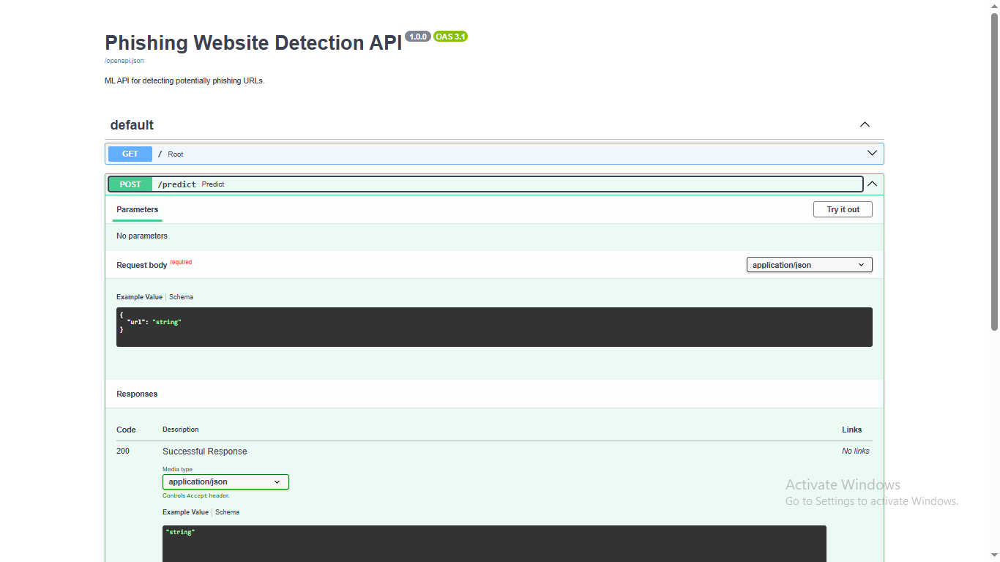

# Phishing Website Detection

> Machine Learning based web application for detecting potentially phishing URLs.


## Overview

Phishing Website Detection is a machine learning based web application that analyzes a submitted website URL and classifies it as either:

- **Legitimate**
- **Phishing**

The application provides a simple web interface where a user can enter a URL and receive the model's prediction along with its confidence probability.

The project combines a **React frontend**, **FastAPI backend**, and a trained **Character TF-IDF + Logistic Regression** machine learning pipeline.

---

## Screenshots

### Main Interface

The main PHISHGUARD interface provides the URL analyzer, system status, and deployed ML pipeline overview.



### Legitimate URL Detection

Example of the application classifying a submitted URL as legitimate.



### Phishing URL Detection

Example of the application identifying a test URL as potentially phishing.



### Detection Matrix

The detection matrix shows the processing pipeline used by the deployed model.



### FastAPI Documentation

Interactive FastAPI Swagger documentation for the `/predict` endpoint.



## Features

- URL-based phishing detection
- Character-level TF-IDF feature extraction
- Logistic Regression classification
- Prediction probability
- React-based web interface
- FastAPI REST API
- Responsive UI
- Input URL validation
- Swagger API documentation
- Trained model stored as a Joblib artifact
- Production frontend build using Vite

---

## System Architecture

```text
                    ┌──────────────────────┐
                    │      User / Browser  │
                    └──────────┬───────────┘
                               │
                               │ URL
                               ▼
                    ┌──────────────────────┐
                    │   React Frontend     │
                    │      + Vite          │
                    └──────────┬───────────┘
                               │
                               │ POST /predict
                               ▼
                    ┌──────────────────────┐
                    │    FastAPI Backend   │
                    └──────────┬───────────┘
                               │
                               ▼
                    ┌──────────────────────┐
                    │ Character TF-IDF     │
                    │ Vectorization        │
                    └──────────┬───────────┘
                               │
                               ▼
                    ┌──────────────────────┐
                    │ Logistic Regression  │
                    │ Classifier            │
                    └──────────┬───────────┘
                               │
                               ▼
                    ┌──────────────────────┐
                    │ Prediction +          │
                    │ Probability           │
                    └──────────┬───────────┘
                               │
                               ▼
                    ┌──────────────────────┐
                    │ React Result Screen  │
                    └──────────────────────┘